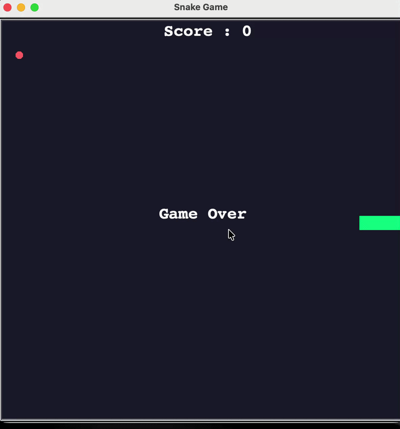

# 🐍 Snake Game

A classic Snake game built in Python using the Turtle graphics library.

## Features
- Smooth snake movement with keyboard controls
- Food collision and snake growth
- Score tracking
- Wall and self-collision detection
- Game Over screen with Retry and Exit buttons

## Demo

## How to Run

### Prerequisites
- Python 3.x

### Steps
git clone https://github.com/yourusername/snake-game-python.git
cd snake-game-python
python main.py

## Controls
| Key | Action |
|-----|--------|
| ↑ | Move Up |
| ↓ | Move Down |
| ← | Move Left |
| → | Move Right |

## Project Structure
snake-game-python/
├── main.py          # Game loop and screen setup
├── snake.py         # Snake class and movement logic
├── food.py          # Food class and random placement
├── scoreboard.py    # Score tracking and UI text
└── README.md

## What I Learned
- Object-oriented programming with Python classes
- Inheritance using Python's Turtle library
- Game loop logic and collision detection
- Separating concerns across multiple files

## Future Improvements
- High score persistence using file I/O
- Increasing speed as score grows
- Sound effects
